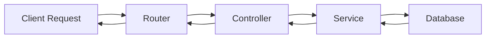
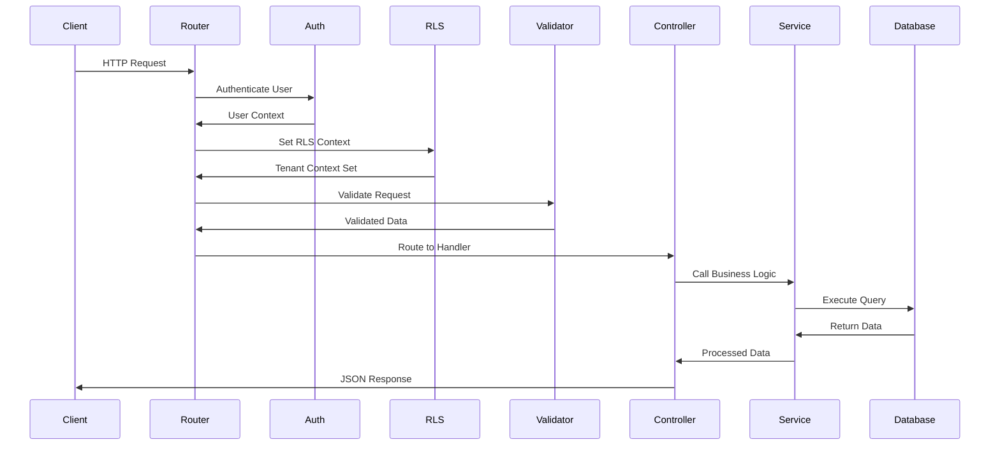
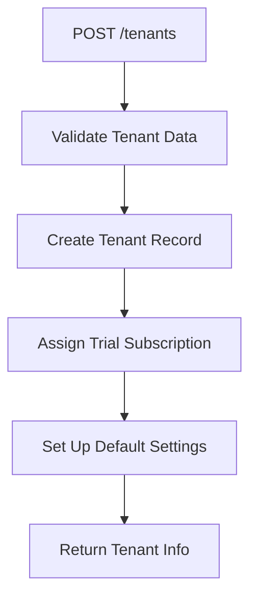
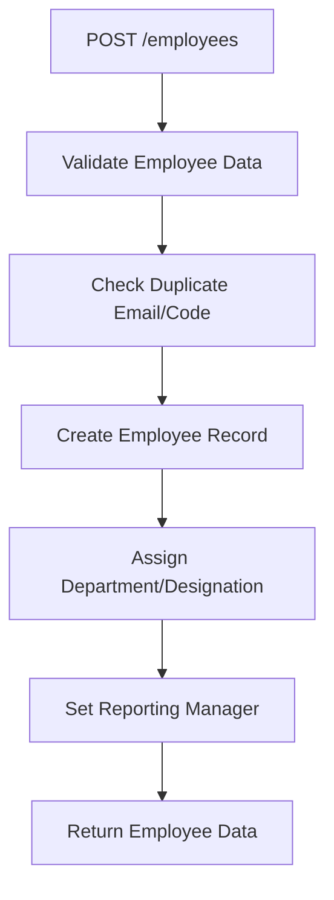
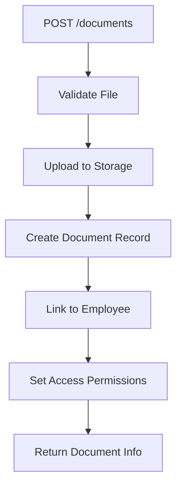
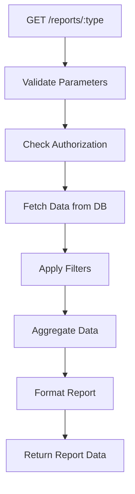
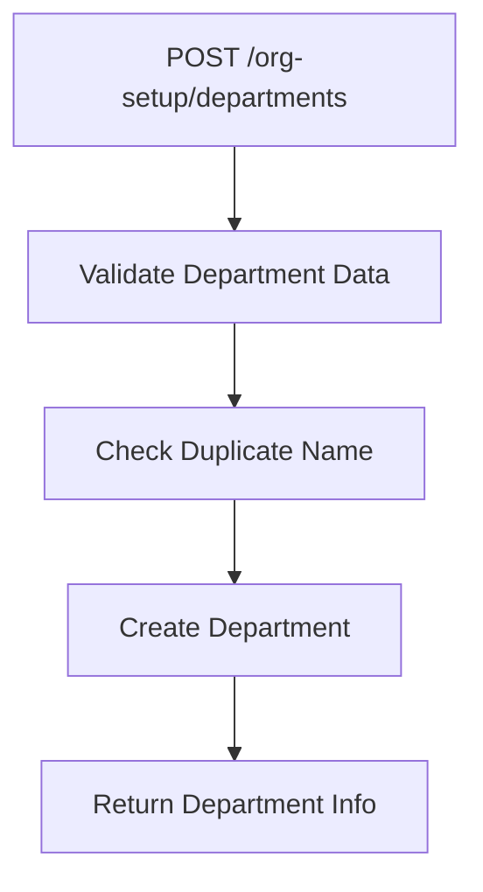
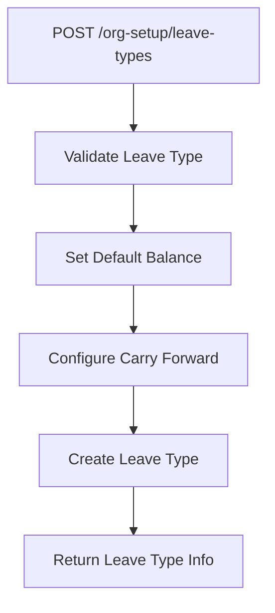
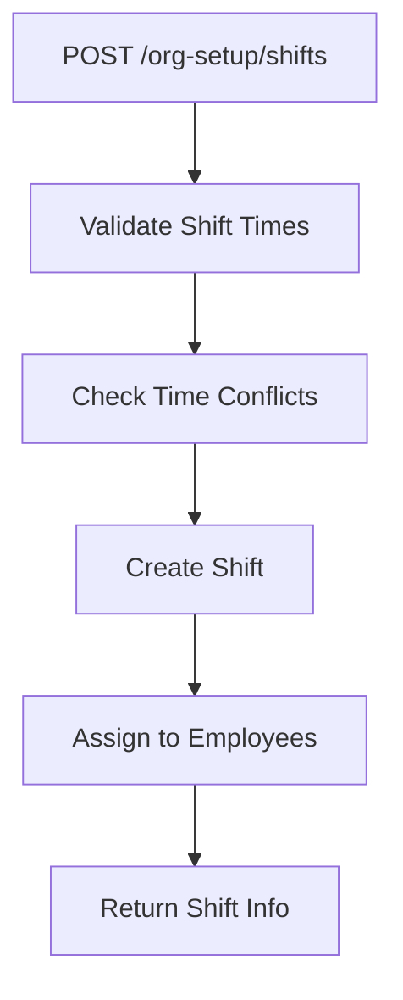

# HRMS Module Workflows Documentation

This document provides a comprehensive overview of the workflow for each module in the HRMS SaaS application located at `src/modules`.

---

## 📋 Table of Contents

1. [Standard Module Architecture](#standard-module-architecture)
2. [Module-by-Module Workflows](#module-by-module-workflows)
   - [Authentication (auth)](#1-authentication-auth)
   - [Tenants](#2-tenants)
   - [Employees](#3-employees)
   - [Attendance](#4-attendance)
   - [Leaves](#5-leaves)
   - [Documents](#6-documents)
   - [Roles](#7-roles)
   - [Reports](#8-reports)
   - [Subscriptions](#9-subscriptions)
   - [Organization Setup (org-setup)](#10-organization-setup-org-setup)
3. [Common Patterns](#common-patterns)

---

## Standard Module Architecture

All modules in the HRMS system follow a consistent **4-layer architecture**:



### Layer Responsibilities

 Layer  File Pattern  Purpose 
-----------------------------
 **Router**  `*.router.js` / `*.routes.js`  Defines API endpoints, applies middleware (auth, validation, RLS), routes to controllers 
 **Validator**  `*.validator.js`  Defines Zod schemas for request validation (body, query, params) 
 **Controller**  `*.controller.js`  Handles HTTP request/response, calls service layer, formats responses 
 **Service**  `*.service.js`  Contains business logic, database queries, data transformations 

---

## Request Flow Diagram



---

## Module-by-Module Workflows

### 1. Authentication (auth)

**Purpose**: Handles user authentication, session management, and permissions

**Files**:
- `auth.router.js` - Authentication endpoints
- `auth.controller.js` - Auth request handlers
- `auth.service.js` - Authentication logic
- `auth.validator.js` - Login/register validation
- `session.service.js` - Session management
- `permission.service.js` - Permission checks

**Key Workflows**:

#### Login Flow
```mermaid
graph TD
    A[POST /auth/login] --> B[Validate Credentials]
    B --> C{Valid?}
    C -->Yes D[Generate JWT Token]
    C -->No E[Return 401 Error]
    D --> F[Create Session]
    F --> G[Return Token + User Data]
```

**Endpoints**:
- `POST /auth/login` - User login
- `POST /auth/register` - User registration
- `POST /auth/logout` - User logout
- `GET /auth/me` - Get current user info
- `POST /auth/refresh` - Refresh JWT token

**Access Control**: Public (login/register), Authenticated (me, logout, refresh)

---

### 2. Tenants

**Purpose**: Multi-tenant organization management

**Files**:
- `tenant.routes.js`
- `tenant.controller.js`
- `tenant.service.js`
- `tenant.validator.js`

**Key Workflows**:

#### Tenant Creation Flow


**Endpoints**:
- `POST /tenants` - Create new tenant
- `GET /tenants/:id` - Get tenant details
- `PATCH /tenants/:id` - Update tenant
- `GET /tenants` - List tenants (ADMIN only)

**Access Control**: ADMIN only for most operations

**Special Features**:
- Automatic trial period assignment during registration
- Subscription integration
- Tenant-specific data isolation via RLS

---

### 3. Employees

**Purpose**: Employee profile and information management

**Files**:
- `employees.router.js`
- `employees.controller.js`
- `employees.service.js`
- `employees.validator.js`

**Key Workflows**:

#### Employee Creation Flow


**Endpoints**:
- `POST /employees` - Create employee (ADMIN, HR)
- `GET /employees` - List employees with filters (ADMIN, HR, MANAGER)
- `GET /employees/:id` - Get employee details (ADMIN, HR, MANAGER)
- `PATCH /employees/:id` - Update employee (ADMIN, HR)

**Access Control**:
- **Create/Update**: ADMIN, HR
- **Read**: ADMIN, HR, MANAGER

**Features**:
- Employee code generation
- Department and designation assignment
- Reporting hierarchy (reports_to)
- Status management (ACTIVE, INACTIVE, DELETED)
- Search and filtering by department, status, name

---

### 4. Attendance

**Purpose**: Employee attendance tracking and management

**Files**:
- `attendance.router.js`
- `attendance.controller.js`
- `attendance.service.js`
- `attendance.validator.js`

**Key Workflows**:

#### Clock In/Out Flow
```mermaid
graph TD
    A[POST /attendance/clock-in] --> B[Check Existing Clock-In]
    B --> C{Already Clocked In?}
    C -->Yes D[Return Error]
    C -->No E[Create Attendance Record]
    E --> F[Set Clock-In Time]
    F --> G[Return Attendance Data]
    
    H[POST /attendance/clock-out] --> I[Find Active Attendance]
    I --> J{Found?}
    J -->Yes K[Update Clock-Out Time]
    J -->No L[Return Error]
    K --> M[Calculate Hours Worked]
    M --> N[Return Updated Record]
```

**Endpoints**:
- `POST /attendance/clock-in` - Clock in (EMPLOYEE)
- `POST /attendance/clock-out` - Clock out (EMPLOYEE)
- `GET /attendance` - List attendance records (ADMIN, HR, MANAGER)
- `GET /attendance/team/summary-report` - Team summary (MANAGER)
- `GET /attendance/my` - Employee's own attendance (EMPLOYEE)

**Access Control**:
- **Clock In/Out**: All authenticated users
- **View All**: ADMIN, HR, MANAGER
- **View Own**: EMPLOYEE

**Features**:
- Automatic time tracking
- Hours worked calculation
- Team attendance reports for managers
- Date range filtering
- Status tracking (PRESENT, ABSENT, HALF_DAY, etc.)

---

### 5. Leaves

**Purpose**: Leave request and approval management

**Files**:
- `leave.router.js`
- `leave.controller.js`
- `leave.service.js`
- `leave.validator.js`

**Key Workflows**:

#### Leave Request Flow
```mermaid
graph TD
    A[POST /leaves] --> B[Validate Leave Dates]
    B --> C[Check Leave Balance]
    C --> D{Sufficient Balance?}
    D -->Yes E[Create Leave Request]
    D -->No F[Return Error]
    E --> G[Set Status: PENDING]
    G --> H[Notify Manager]
    H --> I[Return Leave Request]
```

#### Leave Approval Flow
```mermaid
graph TD
    A[PATCH /leaves/:id/approve] --> B[Check Authorization]
    B --> C{Is Manager/HR/Admin?}
    C -->Yes D[Update Status: APPROVED]
    C -->No E[Return 403 Error]
    D --> F[Deduct Leave Balance]
    F --> G[Notify Employee]
    G --> H[Return Updated Request]
```

**Endpoints**:
- `POST /leaves` - Create leave request (EMPLOYEE)
- `GET /leaves` - List leave requests (role-based filtering)
- `GET /leaves/:id` - Get leave details
- `PATCH /leaves/:id/approve` - Approve leave (MANAGER, HR, ADMIN)
- `PATCH /leaves/:id/reject` - Reject leave (MANAGER, HR, ADMIN)
- `DELETE /leaves/:id` - Cancel leave (EMPLOYEE - own requests only)

**Access Control**:
- **Create**: All employees
- **Approve/Reject**: MANAGER, HR, ADMIN
- **View All**: ADMIN, HR
- **View Team**: MANAGER
- **View Own**: EMPLOYEE

**Features**:
- Leave balance checking
- Multi-level approval workflow
- Leave type integration
- Date conflict detection
- Status tracking (PENDING, APPROVED, REJECTED, CANCELLED)

---

### 6. Documents

**Purpose**: Employee document management and storage

**Files**:
- `document.router.js`
- `document.controller.js`
- `document.service.js`
- `document.validator.js`

**Key Workflows**:

#### Document Upload Flow


**Endpoints**:
- `POST /documents` - Upload document (ADMIN, HR)
- `GET /documents` - List documents (role-based)
- `GET /documents/:id` - Get document details
- `DELETE /documents/:id` - Delete document (ADMIN, HR)

**Access Control**:
- **Upload/Delete**: ADMIN, HR
- **View All**: ADMIN, HR
- **View Own**: EMPLOYEE

**Features**:
- File upload handling
- Document categorization
- Employee-specific documents
- Access control based on roles
- Document metadata tracking

---

### 7. Roles

**Purpose**: Role and permission management

**Files**:
- `role.routes.js`
- `role.controller.js`
- `role.service.js`
- `role.validator.js`

**Key Workflows**:

#### Role Assignment Flow
```mermaid
graph TD
    A[PATCH /roles/assign] --> B[Validate User & Role]
    B --> C{Valid Role?}
    C -->Yes D[Check Permissions]
    C -->No E[Return Error]
    D --> F{Authorized?}
    F -->Yes G[Update User Role]
    F -->No H[Return 403]
    G --> I[Update Permissions]
    I --> J[Return Success]
```

**Endpoints**:
- `GET /roles` - List all roles
- `POST /roles` - Create custom role (ADMIN)
- `PATCH /roles/:id` - Update role (ADMIN)
- `DELETE /roles/:id` - Delete role (ADMIN)

**Access Control**: ADMIN only

**Role Hierarchy**:
1. **ADMIN** - Full system access
2. **HR** - Employee and leave management
3. **MANAGER** - Team management (based on reports_to)
4. **EMPLOYEE** - Self-service access

---

### 8. Reports

**Purpose**: Generate various HR reports and analytics

**Files**:
- `report.routes.js`
- `report.controller.js`
- `report.service.js`
- `report.validator.js`

**Key Workflows**:

#### Report Generation Flow


**Endpoints**:
- `GET /reports/attendance` - Attendance reports (ADMIN, HR, MANAGER)
- `GET /reports/leaves` - Leave reports (ADMIN, HR, MANAGER)
- `GET /reports/employees` - Employee reports (ADMIN, HR)

**Access Control**:
- **ADMIN, HR**: All reports
- **MANAGER**: Team-specific reports

**Features**:
- Date range filtering
- Department-wise reports
- Export capabilities
- Aggregated analytics

---

### 9. Subscriptions

**Purpose**: Manage tenant subscription plans and billing

**Files**:
- `subscription.routes.js`
- `subscription.controller.js`
- `subscription.service.js`
- `subscription.validator.js`

**Key Workflows**:

#### Subscription Upgrade Flow
```mermaid
graph TD
    A[POST /subscriptions/upgrade] --> B[Validate Plan]
    B --> C[Check Current Plan]
    C --> D[Calculate Prorated Amount]
    D --> E[Process Payment]
    E --> F{Payment Success?}
    F -->Yes G[Update Subscription]
    F -->No H[Return Error]
    G --> I[Update Features]
    I --> J[Send Confirmation]
    J --> K[Return New Subscription]
```

**Endpoints**:
- `GET /subscriptions` - Get current subscription
- `POST /subscriptions/upgrade` - Upgrade plan (ADMIN)
- `POST /subscriptions/downgrade` - Downgrade plan (ADMIN)
- `GET /subscriptions/plans` - List available plans
- `POST /subscriptions/cancel` - Cancel subscription (ADMIN)

**Access Control**: ADMIN only

**Features**:
- Trial period management
- Plan upgrade/downgrade
- Automatic trial assignment
- Feature access control based on plan
- Billing cycle management

---

### 10. Organization Setup (org-setup)

**Purpose**: Configure organizational structure and settings

**Structure**: Contains sub-modules for different organizational entities

#### Sub-Modules:

##### a) Departments
**Files**: `departments/department.*.js`

**Workflow**:


**Endpoints**:
- `POST /org-setup/departments` - Create department (ADMIN, HR)
- `GET /org-setup/departments` - List departments
- `PATCH /org-setup/departments/:id` - Update department (ADMIN, HR)
- `DELETE /org-setup/departments/:id` - Delete department (ADMIN, HR)

##### b) Designations
**Files**: `designations/designation.*.js`

**Workflow**: Similar to departments

**Endpoints**:
- `POST /org-setup/designations` - Create designation (ADMIN, HR)
- `GET /org-setup/designations` - List designations
- `PATCH /org-setup/designations/:id` - Update designation (ADMIN, HR)
- `DELETE /org-setup/designations/:id` - Delete designation (ADMIN, HR)

**Special Features**:
- Manager designation flag
- Hierarchy levels

##### c) Leave Types
**Files**: `leave-types/leave-type.*.js`

**Workflow**:


**Endpoints**:
- `POST /org-setup/leave-types` - Create leave type (ADMIN, HR)
- `GET /org-setup/leave-types` - List leave types
- `PATCH /org-setup/leave-types/:id` - Update leave type (ADMIN, HR)
- `DELETE /org-setup/leave-types/:id` - Delete leave type (ADMIN, HR)

**Features**:
- Default balance configuration
- Carry forward rules
- Paid/unpaid designation
- Gender-specific leave types

##### d) Shifts
**Files**: `shifts/shift.*.js`

**Workflow**:


**Endpoints**:
- `POST /org-setup/shifts` - Create shift (ADMIN, HR)
- `GET /org-setup/shifts` - List shifts
- `PATCH /org-setup/shifts/:id` - Update shift (ADMIN, HR)
- `DELETE /org-setup/shifts/:id` - Delete shift (ADMIN, HR)

**Features**:
- Start/end time configuration
- Break time management
- Shift assignment to employees

---

## Common Patterns

### 1. Authentication & Authorization Pattern

All protected routes follow this middleware chain:

```javascript
router.use(auth, setRLSContext());
router.post('/', requireRole(['ADMIN', 'HR']), validate(schema), controller.method);
```

**Middleware Order**:
1. `auth` - Verifies JWT token, attaches user to request
2. `setRLSContext()` - Sets PostgreSQL RLS context for tenant isolation
3. `requireRole([...])` - Checks user role authorization
4. `validate(schema)` - Validates request using Zod schema
5. `controller.method` - Executes business logic

### 2. Validation Pattern

All validators use **Zod** schemas with this structure:

```javascript
const schema = z.object({
  body: z.object({ /* body fields */ }),
  query: z.object({ /* query params */ }),
  params: z.object({ /* URL params */ })
});
```

### 3. Service Layer Pattern

Services follow this structure:

```javascript
class SomeService {
  async create(db, tenantId, payload, userId) { /* ... */ }
  async list(db, tenantId, filters) { /* ... */ }
  async getById(db, tenantId, id) { /* ... */ }
  async update(db, tenantId, id, payload, userId) { /* ... */ }
  async delete(db, tenantId, id) { /* ... */ }
}
```

**Key Points**:
- Always receive `db` (database connection) as first parameter
- Always receive `tenantId` for multi-tenant isolation
- Use parameterized queries to prevent SQL injection
- Throw custom errors (`NotFoundError`, `ValidationError`, etc.)

### 4. Controller Pattern

Controllers follow this structure:

```javascript
class SomeController {
  async methodName(req, res, next) {
    try {
      const result = await service.method(
        req.db,
        req.user.tenantId,
        req.body,
        req.user.userId
      );
      return success(res, result, 'Success message', 201);
    } catch (err) {
      next(err);
    }
  }
}
```

**Key Points**:
- Always wrap in try-catch
- Pass errors to `next(err)` for centralized error handling
- Use `success()` utility for consistent response format
- Extract data from `req.user`, `req.body`, `req.query`, `req.params`

### 5. Multi-Tenant Isolation

All database queries include tenant isolation:

```sql
WHERE tenant_id = $1 AND ...
```

This is enforced through:
- **RLS (Row Level Security)** at database level
- **Middleware** setting tenant context
- **Service layer** always requiring `tenantId` parameter

### 6. Error Handling

Custom errors are used throughout:

```javascript
throw new NotFoundError('Resource not found');
throw new ValidationError('Invalid data');
throw new UnauthorizedError('Access denied');
throw new ForbiddenError('Insufficient permissions');
```

These are caught by centralized error middleware and formatted consistently.

---

## Summary

All modules in the HRMS system follow a **consistent 4-layer architecture** with:

1. **Router** - Endpoint definition and middleware application
2. **Validator** - Request validation using Zod
3. **Controller** - Request/response handling
4. **Service** - Business logic and database operations

This architecture ensures:
- ✅ **Separation of concerns**
- ✅ **Consistent code structure**
- ✅ **Easy testing and maintenance**
- ✅ **Multi-tenant data isolation**
- ✅ **Role-based access control**
- ✅ **Centralized error handling**

Each module can be understood by examining these four files in order: Router → Validator → Controller → Service.
